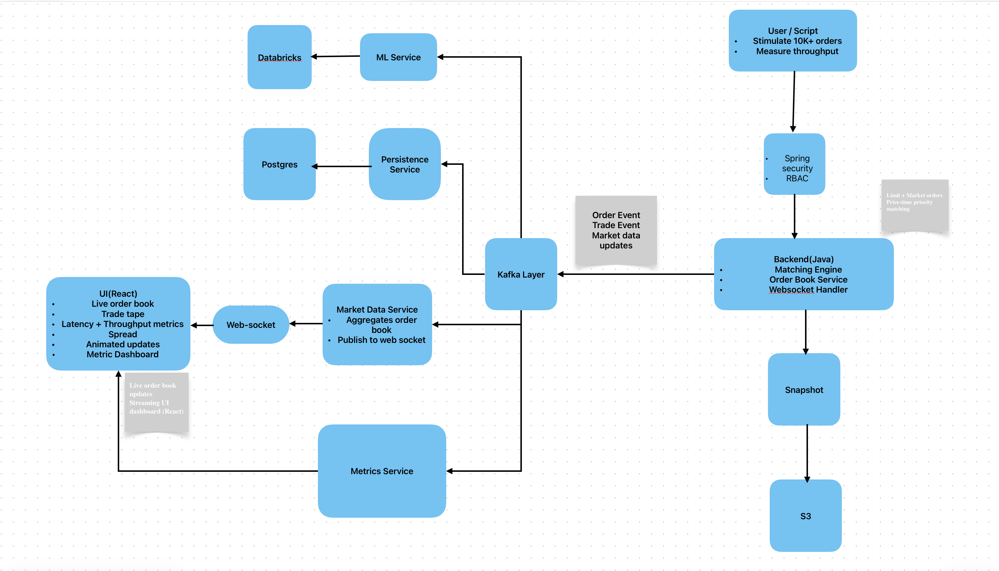

# exchangePipeline

## Getting started

```bash
git clone <repo-url>
cd exchangePipeline
docker compose up -d --build
```

- App: `http://localhost:8080`
- Prometheus: `http://localhost:9090`
- Grafana: `http://localhost:3000` (login: `admin` / `admin`)

## Architecture Diagram


